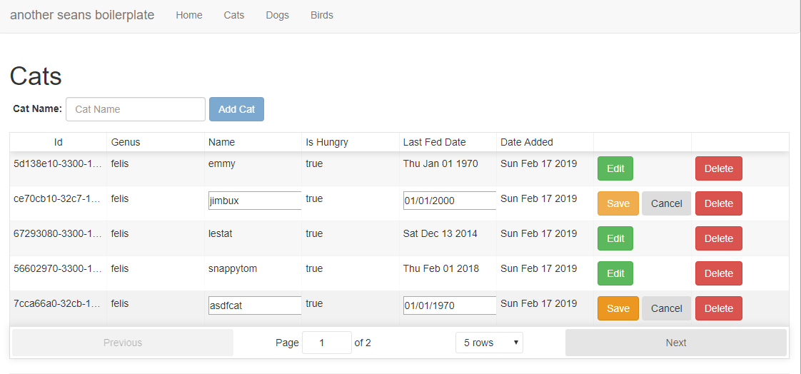
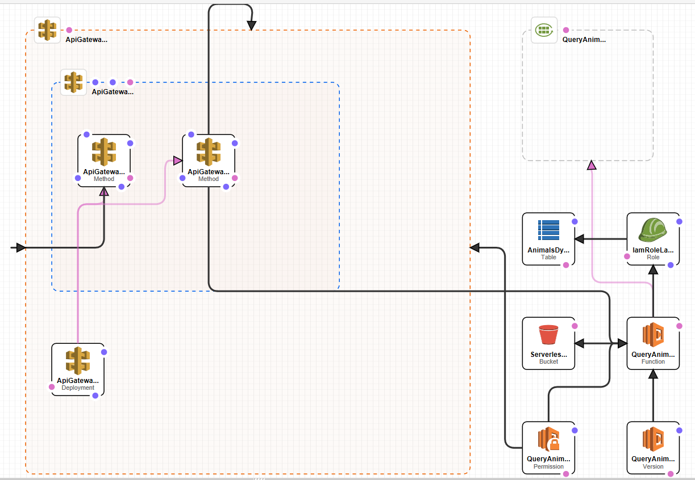

# Seans-NextJS-GraphQL-AWS-APIGateway-Lambda-DynamoDB-Boilerplate 



## Setup

Install AWS CLI using Pip3 from your python 3 install
`$ pip3 install awscli --upgrade --user`

Install Serveless CLI.
`$ npm install serverless -g`

Log into your AWS console and get your API access key and secret. 
Configure AWS cli to use them

CD to folder `serverless\animals-gql` and run `serverless deploy`
after about 1 minute, you should have an AWS API running that the NextJS client will communicate with.
The deploy script you just executed, used AWS Cloud Formation to create an API Gateway, that forwards requests to a Lambda service, and then onto DynamoDB. It also saves the Lambda scripts to S3. 



## To Run the NextJS app, CD to project root and 

```bash
npm install
npm run dev
```

Then

Visit `http://localhost:3000`


## Unit Tests

Contains jest, chai and enzyme tests

`$ npm test`
